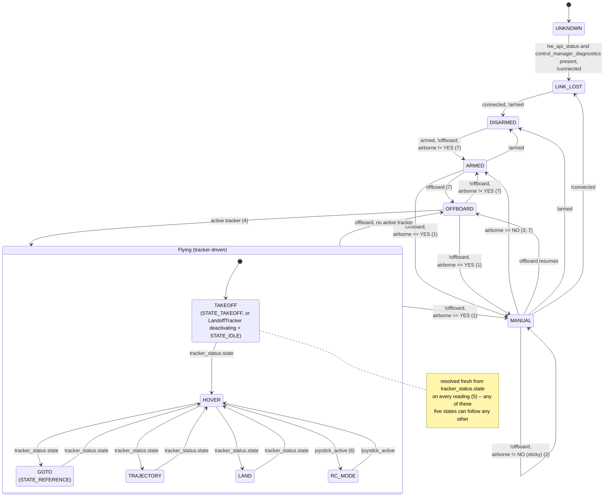

# MRS UAV Managers

Please follow to the [documentation page](https://ctu-mrs.github.io/docs/features/managers/).

## DiagnosticsManager: UAV state

How `parse_uav_state()` (`include/mrs_uav_managers/diagnostics_manager/uav_state_parser.hpp`) turns `hw_api/status` (`mrs_msgs/HwApiStatus`) and `control_manager/diagnostics` (`mrs_msgs/ControlManagerDiagnostics`) into the single `mrs_msgs/State` published as `diagnostics_manager/uav_state`. The function is pure and re-evaluated on every reading (it keeps no state of its own) except for one thing: it is also given the *previous* published state, used only to make `MANUAL` sticky (note 2).

Notes:

1. **Lost (or never had) offboard while airborne**: an explicit `airborne == YES` starts `MANUAL` from any armed state, including mid-flight (losing offboard with a tracker active) -- `LostOffboardWithTrackerStillActiveIsManual`. A stale/`UNKNOWN` in-air reading never *starts* `MANUAL` on its own.
2. **`MANUAL` is sticky**: once entered, only an explicit `airborne == NO` (or `armed`/`connected`/`offboard` changing) ends it -- `airborne == UNKNOWN` (the source went stale) or an out-of-range value keeps `MANUAL`, so a lost in-air sensor can't look like a landing. This only applies when the *previous* published state was `MANUAL`; a fresh (non-`MANUAL`) reading of `airborne == UNKNOWN` falls back to `ARMED`/`OFFBOARD` as if `airborne` were unknown from the start -- `UnknownAirborneWithoutManualBeforeKeepsArmed`.
3. Reachable only when the previous state was `MANUAL` (see note 2).
4. "active tracker" = `active_tracker != "NullTracker"` and `tracker_status.state != STATE_INVALID`.
5. The parser has no memory here (unlike `MANUAL`'s stickiness), so the arrows inside `Flying` show a typical mission, not an enforced order. `airborne` does not affect this resolution once `offboard == true` -- `AirborneUnknownIrrelevantWhenOffboard`. A `tracker_status.state` the switch doesn't recognize (e.g. plain `STATE_IDLE` without `LandoffTracker`) falls through to `UNKNOWN` (not drawn above).
6. `RC_MODE` is drawn from/to `HOVER` only to keep the diagram readable -- `joystick_active` is checked before the tracker-state switch, so it can equally toggle from `TAKEOFF`/`GOTO`/`TRAJECTORY`/`LAND`, not just `HOVER`.
7. Reaching `ARMED` (from any source) or `OFFBOARD` also requires no active tracker (`tracker_state == INVALID`, i.e. `active_tracker == "NullTracker"` or `tracker_status.state == STATE_INVALID`) -- kept out of the arrow labels themselves to keep them readable; see note 4 for the opposite condition ("active tracker").

Evaluation order, top to bottom, re-run from scratch on every reading: missing `hw_api_status`/`control_manager_diagnostics` -> `UNKNOWN`; `!connected` -> `LINK_LOST`; `!armed` -> `DISARMED`; `!offboard && (airborne == YES || (previous == MANUAL && airborne != NO))` -> `MANUAL`; no active tracker -> `OFFBOARD` (if `offboard`) or `ARMED`; `joystick_active` -> `RC_MODE`; `LandoffTracker` deactivating (`STATE_IDLE`) -> `TAKEOFF`; else `tracker_status.state` -> `TAKEOFF`/`HOVER`/`GOTO`/`TRAJECTORY`/`LAND` (default `UNKNOWN`). Only the `MANUAL` check reads `previous`.

### Transitions and the tests that cover them

All tests are `TEST(UavStateParser, ...)` in `test/diagnostics_manager/uav_state_parser/test.cpp`.

| Transition | Test |
|---|---|
| missing `hw_api_status`/`control_manager_diagnostics` -> `UNKNOWN` | `MissingInputsAreUnknown` |
| any -> `LINK_LOST`: `!connected` (overrides armed/airborne) | `DisconnectedIsLinkLost` |
| any -> `DISARMED`: connected, `!armed` (overrides airborne) | `DisarmedWinsEvenInAir` |
| `DISARMED` -> `ARMED`: armed, `!offboard`, `airborne == NO` | `ArmedOnGroundWithoutOffboardIsArmed`, `UnknownAirborneKeepsArmed` |
| `ARMED` -> `OFFBOARD`: offboard, no active tracker | `OffboardTakeoffIsNotManual` |
| `OFFBOARD` -> `ARMED`: `!offboard`, `airborne == NO`, no active tracker | `LingeringJoystickDoesNotChangeManual` |
| `ARMED` / `OFFBOARD` / `FLYING` -> `MANUAL`: `!offboard`, `airborne == YES` | `AirborneWithoutOffboardIsManualInEveryMode`, `LostOffboardWithTrackerStillActiveIsManual` |
| `MANUAL` -> `MANUAL`: `!offboard`, `airborne == UNKNOWN` (sticky) | `ManualIsStickyWhileAirborneUnknown` |
| `MANUAL` -> `ARMED`: `airborne == NO` | `ManualEndsOnExplicitLandingDisarmOffboardOrLinkLoss` |
| `MANUAL` -> `OFFBOARD`: offboard resumes | `ManualEndsOnExplicitLandingDisarmOffboardOrLinkLoss` |
| `MANUAL` -> `DISARMED`: `!armed` | `ManualEndsOnExplicitLandingDisarmOffboardOrLinkLoss` |
| `MANUAL` -> `LINK_LOST`: `!connected` | `ManualEndsOnExplicitLandingDisarmOffboardOrLinkLoss` |
| non-`MANUAL` previous + `airborne == UNKNOWN` -> `ARMED` (no stickiness) | `UnknownAirborneWithoutManualBeforeKeepsArmed` |
| `HOVER` <-> `RC_MODE`: `joystick_active` toggling (6) | `OffboardFlightUnchanged`, `AirborneUnknownIrrelevantWhenOffboard` |
| `OFFBOARD` -> `FLYING`: active tracker, `tracker_status.state` | `OffboardFlightUnchanged`, `TrackerStateMapsDirectly`, `AirborneUnknownIrrelevantWhenOffboard` |
| `FLYING` (`LandoffTracker` deactivating, `STATE_IDLE`) -> `TAKEOFF` | `LandoffTrackerIdleIsTakeoff` |
| `airborne` irrelevant once `offboard == true` (closes a known gap) | `AirborneUnknownIrrelevantWhenOffboard` |
