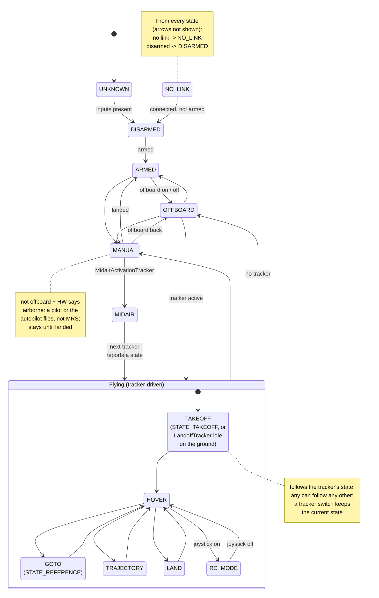

# MRS UAV Managers

Please follow to the [documentation page](https://ctu-mrs.github.io/docs/features/managers/).

## DiagnosticsManager: UAV state

How `parse_uav_state()` (`include/mrs_uav_managers/diagnostics_manager/uav_state_parser.hpp`) turns `hw_api/status` (`mrs_msgs/HwApiStatus`) and `control_manager/diagnostics` (`mrs_msgs/ControlManagerDiagnostics`) into the single `mrs_msgs/State` published as `diagnostics_manager/uav_state`. The state is re-evaluated from scratch on every reading; the rules are listed below the diagram.

### How the state is decided

On every reading the parser checks these rules from the top and stops at the first one that matches:

1. Missing input (`hw_api/status` or `control_manager/diagnostics` not received yet) -> `UNKNOWN`.
2. HW API not connected to the autopilot -> `NO_LINK`.
3. Not armed -> `DISARMED`.
4. The active tracker is `MidairActivationTracker` -> `MIDAIR`.
5. Not offboard and the HW says the UAV is airborne -> `MANUAL`. Once in `MANUAL`, it stays there until the HW says the UAV has landed (`airborne == NO`) or offboard comes back. An unknown airborne reading does not end it.
6. No active tracker (`NullTracker`, or the tracker reports `STATE_INVALID`):
   - offboard, the previous state was a flight state, and the tracker isn't `NullTracker` -> keep the previous state (a tracker switch in flight);
   - otherwise -> `OFFBOARD` if offboard, `ARMED` if not.
7. Joystick active -> `RC_MODE`.
8. `LandoffTracker` reports `STATE_IDLE` -> `TAKEOFF`, unless the previous state was a flight state other than `TAKEOFF`; then keep the previous state.
9. Otherwise the tracker's state decides: `STATE_TAKEOFF` -> `TAKEOFF`, `STATE_HOVER` -> `HOVER`, `STATE_REFERENCE` -> `GOTO`, `STATE_TRAJECTORY` -> `TRAJECTORY`, `STATE_LAND` -> `LAND`, anything else -> `UNKNOWN`.

"Flight state" means `TAKEOFF`, `HOVER`, `GOTO`, `TRAJECTORY`, `LAND`, `RC_MODE` or `MIDAIR` (`is_flying_autonomously()`).

### Why some rules exist

- **The previous state**: the parser keeps no state of its own. It gets the previously published state and uses it only in rules 5, 6 and 8.
- **`MIDAIR` (rule 4)**: UavManager is taking over a UAV already in the air: control output ON, then `MidairActivationTracker` holds the UAV while the autopilot is switched to offboard, then the next tracker takes over. `MidairActivationTracker` never reports a tracker state, so it is recognised by name. It is checked before `MANUAL` because until offboard is confirmed the HW still reports a pilot flying. It counts as flying for `is_flying()` and `is_flying_autonomously()`.
- **`MANUAL` stays until landed (rule 5)**: if the airborne source goes stale (`UNKNOWN`), that must not look like a landing. Without a previous `MANUAL`, an unknown airborne reading gives `ARMED`/`OFFBOARD` as usual.
- **Tracker switch in flight (rule 6)**: a tracker activated in the air (`LandoffTracker` for land, land home, eland or escalating failsafe; the tracker taking over after a mid-air activation) reports `STATE_INVALID` for its first ~60-240 ms. Without this rule the state would drop to `OFFBOARD` mid-air and `is_flying()` would briefly be false. `NullTracker` really means no tracker, so after a landing the state still goes to `OFFBOARD`.
- **`LandoffTracker` idle (rule 8)**: after a takeoff, `LandoffTracker` goes idle before the next tracker takes over -- still `TAKEOFF`. Activated in the air (e.g. escalating failsafe -> eland) it is idle before it starts landing; that is not a takeoff.
- **Inside `Flying`**: the arrows show a typical mission. Any flight state can follow any other, and the joystick (`RC_MODE`) can take over from any of them, not just `HOVER`.

### Transitions and the tests that cover them

All tests are `TEST(UavStateParser, ...)` in `test/diagnostics_manager/uav_state_parser/test.cpp`.

| Transition | Test |
|---|---|
| missing `hw_api_status`/`control_manager_diagnostics` -> `UNKNOWN` | `MissingInputsAreUnknown` |
| any -> `NO_LINK`: `!connected` (overrides armed/airborne) | `DisconnectedIsLinkLost` |
| any -> `DISARMED`: connected, `!armed` (overrides airborne) | `DisarmedWinsEvenInAir` |
| `DISARMED` -> `ARMED`: armed, `!offboard`, `airborne == NO` | `ArmedOnGroundWithoutOffboardIsArmed`, `UnknownAirborneKeepsArmed` |
| `ARMED` -> `OFFBOARD`: offboard, no active tracker | `OffboardTakeoffIsNotManual` |
| `OFFBOARD` -> `ARMED`: `!offboard`, `airborne == NO`, no active tracker | `LingeringJoystickDoesNotChangeManual` |
| `ARMED` / `OFFBOARD` / `FLYING` -> `MANUAL`: `!offboard`, `airborne == YES` | `AirborneWithoutOffboardIsManualInEveryMode`, `LostOffboardWithTrackerStillActiveIsManual` |
| `MANUAL` -> `MANUAL`: `!offboard`, `airborne == UNKNOWN` (sticky) | `ManualIsStickyWhileAirborneUnknown` |
| `MANUAL` -> `ARMED`: `airborne == NO` | `ManualEndsOnExplicitLandingDisarmOffboardOrLinkLoss` |
| `MANUAL` -> `OFFBOARD`: offboard resumes | `ManualEndsOnExplicitLandingDisarmOffboardOrLinkLoss` |
| `MANUAL` -> `DISARMED`: `!armed` | `ManualEndsOnExplicitLandingDisarmOffboardOrLinkLoss` |
| `MANUAL` -> `NO_LINK`: `!connected` | `ManualEndsOnExplicitLandingDisarmOffboardOrLinkLoss` |
| non-`MANUAL` previous + `airborne == UNKNOWN` -> `ARMED` (no stickiness) | `UnknownAirborneWithoutManualBeforeKeepsArmed` |
| `HOVER` <-> `RC_MODE`: `joystick_active` toggling | `OffboardFlightUnchanged`, `AirborneUnknownIrrelevantWhenOffboard` |
| `OFFBOARD` -> `FLYING`: active tracker, `tracker_status.state` | `OffboardFlightUnchanged`, `TrackerStateMapsDirectly`, `AirborneUnknownIrrelevantWhenOffboard` |
| `FLYING` (`LandoffTracker` deactivating, `STATE_IDLE`) -> `TAKEOFF` | `LandoffTrackerIdleIsTakeoff` |
| `FLYING` (`LandoffTracker` activated in the air, `STATE_IDLE`) keeps the flight phase | `LandoffTrackerIdleInFlightIsNotTakeoff` |
| `FLYING` -> `FLYING`: tracker switch (`STATE_INVALID`, not `NullTracker`) keeps the state | `TrackerSwitchInFlightKeepsState` |
| `OFFBOARD` stays: new tracker `STATE_INVALID` on the ground | `NewTrackerOnGroundIsStillOffboard` |
| `FLYING` -> `OFFBOARD`: `NullTracker` after a flight | `NullTrackerAfterFlightIsOffboard` |
| `MANUAL` / `ARMED` / `OFFBOARD` -> `MIDAIR`: `MidairActivationTracker` (any `airborne`) | `MidairActivationTrackerIsMidairActivation` |
| `MIDAIR` -> `DISARMED` / `NO_LINK` | `MidairActivationYieldsToDisarmAndLinkLoss` |
| `MANUAL` -> `MIDAIR` -> (switch, `STATE_INVALID`) -> `GOTO` -> `HOVER` | `MidairActivationSequenceStaysFlying` |
| `MIDAIR` is flying (`is_flying`, `is_flying_autonomously`), maps to `STATE_MIDAIR` | `MidairActivationIsFlying`, `MidairActivationMapsToMessage` |
| `airborne` irrelevant once `offboard == true` (closes a known gap) | `AirborneUnknownIrrelevantWhenOffboard` |
